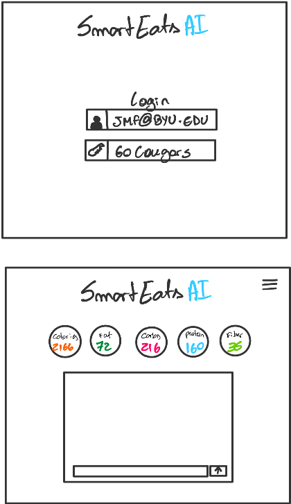

# SmartEats AI

[My Notes](notes.md)

SmartEats AI is an AI-Powered nutrition assistant that helps you make smart and personalized food choices. You can use it for dining out or cooking at home, this app gives you tailored recommendations based on your nutritional goals, offering mean suggestions, restaurant options, and even recipes to support your health and fitness goals!

> [!NOTE]
>  This is a template for your startup application. You must modify this `README.md` file for each phase of your development. You only need to fill in the section for each deliverable when that deliverable is submitted in Canvas. Without completing the section for a deliverable, the TA will not know what to look for when grading your submission. Feel free to add additional information to each deliverable description, but make sure you at least have the list of rubric items and a description of what you did for each item.

> [!NOTE]
>  If you are not familiar with Markdown then you should review the [documentation](https://docs.github.com/en/get-started/writing-on-github/getting-started-with-writing-and-formatting-on-github/basic-writing-and-formatting-syntax) before continuing.

## 🚀 Specification Deliverable

For this deliverable I did the following. I checked the box `[x]` and added a description for things I completed.

- [x] Proper use of Markdown
- [x] A concise and compelling elevator pitch
- [x] Description of key features
- [x] Description of how you will use each technology
- [x] One or more rough sketches of your application. Images must be embedded in this file using Markdown image references.

### Elevator pitch

Trying to eat healthier but stuck wondering what or where to eat when hunger hits? SmartEats AI makes food choice easy! Whether you are dining out, meal planning, or cooking at home, our AI-Powered app gives you tailored meal suggestions specificaly designed for your nutritional goals. Make smarter food choices!

### Design

### Key features

- Interactive Chat: Provides AI assistant for nutritional guidance 
- Goal based recommendations: Tailored meal and snack suggestions to match colorie and macro targets
- Recipe and ingredient swapping: Provides recipe suggestions, or alternative ingredient for existing recipes based on user preferences
- Restaurant integreation: Suggests meals at local restaurants that fit coloric and macro nutrient goals
- Progress tracking: Adjusts the coloric and nutrient intake based on logged meals and remaining goals

### Technologies

I am going to use the required technologies in the following ways.

- **HTML**  
  - Main structure for the app (login and chat pages).  
  - The login page will include:
      1. user input forms
      2. error messaging
  - The chat page will have sections for:
    1. Recommendations
    2. User inputs
    3. Dynamic display of macronutrient intake progress  

- **CSS**  
  - Used for style and design to ensure intuitive navigation and readability:  
      1. Chat bubbles to differentiate user and app inputs/outputs
      2. Dynamic progress bars for the macronutrient section
      3. Adaptive layouts for mobile screens

- **React**  
  - Handles the interactive front end. Features include:  
    1. ChatBox (real-time user interaction) 
    2. Recommendation Card (Displays meal suggestions)  
    3. Progress Tracker (updates based on user goals and logs)  
  - State management to track user goals, meal logs, and chat history.  

- **Service**  
  - Manages business logic with the following APIs:  
    1. User Authentication API (login and profile management) 
    2. Logging API (Handles meal logging and updates progress)  
    3. Recommendation API (Generates suggestions)

- **DB/Login**  
  - Stores and retrieves important data:  
    1. User profiles  
    2. Nutritional logs  
    3. Restaurant data  
    4. Chat history  

- **WebSocket**  
  - real-time updates and communication in the chat interface.
  - When user logs a meal, the app updates on the screen their colories and macros 

## 🚀 AWS deliverable

For this deliverable I did the following. I checked the box `[x]` and added a description for things I completed.

- [x] **Server deployed and accessible with custom domain name** - [My server link](https://yourdomainnamehere.click).

## 🚀 HTML deliverable

For this deliverable I did the following. I checked the box `[x]` and added a description for things I completed.

- [x] **HTML pages** - COMPLETED - The pages are Login, Home, and meal tracker
- [x] **Proper HTML element usage** - COMPLETED - for all my pages I properly used the elements as in the instructions and simon
- [x] **Links** - COMPLETED - Included link for GitHub and between pages
- [x] **Text** - COMPLETED - I have text between my pages
- [x] **3rd party API placeholder** - COMPLETED - There is a space where user can update calories and withdraw values from table, such as update table
- [x] **Images** - COMPLETED - Login page has an image
- [x] **Login placeholder** - COMPLETED - the first default page is the login page
- [x] **DB data placeholder** - COMPLETED - Meal Tracker page contains a table that can be updated by user
- [x] **WebSocket placeholder** - COMPLETED - the Home page has a spot where app sends notifications to users

## 🚀 CSS deliverable

For this deliverable I did the following. I checked the box `[x]` and added a description for things I completed.

- [x] **Header, footer, and main content body** - COMPLETED - edited text and standardized format across pages  
- [x] **Navigation elements** - COMPLETED - Applied styles to different elements  
- [x] **Responsive to window resizing** - COMPLETED - The app auto resizes, including images  
- [x] **Application elements** - COMPLETED - All elements have same formatting across pages  
- [x] **Application text content** - COMPLETED - Applied different styles to text  
- [x] **Application images** - COMPLETED - only the login page has an image  
## 🚀 React part 1: Routing deliverable

For this deliverable I did the following. I checked the box `[x]` and added a description for things I completed.

- [x] **Bundled using Vite** - COMPLETED
- [x] **Components** - COMPLETED
- [x] **Router** - COMPLETED

## 🚀 React part 2: Reactivity

For this deliverable I did the following. I checked the box `[x]` and added a description for things I completed.

- [x] **All functionality implemented or mocked out** - COMPLETED
- [x] **Hooks** - COMPLETED.

## 🚀 Service deliverable

For this deliverable I did the following. I checked the box `[x]` and added a description for things I completed.

- [ ] **Node.js/Express HTTP service** - I did not complete this part of the deliverable.
- [ ] **Static middleware for frontend** - I did not complete this part of the deliverable.
- [ ] **Calls to third party endpoints** - I did not complete this part of the deliverable.
- [ ] **Backend service endpoints** - I did not complete this part of the deliverable.
- [ ] **Frontend calls service endpoints** - I did not complete this part of the deliverable.

## 🚀 DB/Login deliverable

For this deliverable I did the following. I checked the box `[x]` and added a description for things I completed.

- [ ] **User registration** - I did not complete this part of the deliverable.
- [ ] **User login and logout** - I did not complete this part of the deliverable.
- [ ] **Stores data in MongoDB** - I did not complete this part of the deliverable.
- [ ] **Stores credentials in MongoDB** - I did not complete this part of the deliverable.
- [ ] **Restricts functionality based on authentication** - I did not complete this part of the deliverable.

## 🚀 WebSocket deliverable

For this deliverable I did the following. I checked the box `[x]` and added a description for things I completed.

- [ ] **Backend listens for WebSocket connection** - I did not complete this part of the deliverable.
- [ ] **Frontend makes WebSocket connection** - I did not complete this part of the deliverable.
- [ ] **Data sent over WebSocket connection** - I did not complete this part of the deliverable.
- [ ] **WebSocket data displayed** - I did not complete this part of the deliverable.
- [ ] **Application is fully functional** - I did not complete this part of the deliverable.
